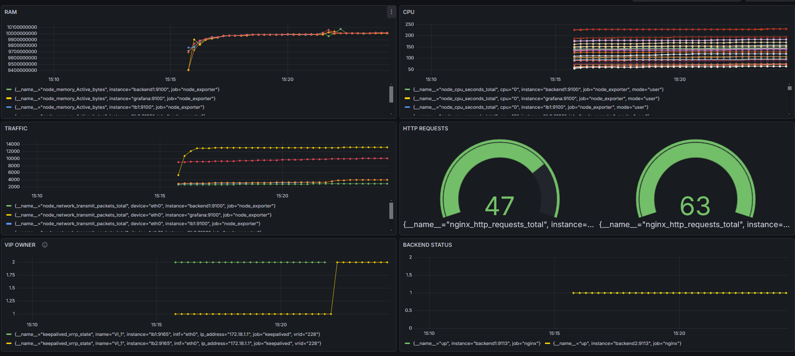

# Перед началом использования
**Необходимо переместить в директорию ./ansible/playbooks/monitoring файлы** из
*https://drive.google.com/file/d/1JximJBBy-RnKHoi4ZbmnrYdvrU9f8abw/view?usp=sharing*.
В архиве содержатся софт grafana/victoriametrics/prometheus/node_exporter.

Содержимое архива:
```
srertk_deb_and_tar.zip
├── grafana-enterprise_12.3.1_20271043721_linux_amd64.deb
├── node_exporter-1.10.2.linux-amd64.tar.gz
├── prometheus-3.5.1.linux-amd64.tar.gz
└── victoria-metrics-linux-amd64-v1.134.0.tar.gz
```
## Контейнеры docker compose
| HOSTNAME  | назначение| целевой софт|
| ------------- |:-------------:|:-------------:|
| backend1      | бэкэнд    |nginx
| backend2      | запасной бэкэнд  |nginx
| lb1      |   балансировщик  |nginx+keepalived
| lb2      | запасной балансировщик   |nginx+keepalived
| mon      | сбор и хранение метрик   |prometheus+victoriametrics
| grafana      | визуализация метрик    |grafana
| ansible      | автоматизация деплоя   |ansible

## Список экспортеров
| Экспортер  | Назначение|ссылка|
| ------------- |:-------------:|:-------------:|
| node_exporter      | базовые метрики(CPU,RAM,net, etc.)    |https://github.com/prometheus/node_exporter
|nginx_exporter|метрики nginx|https://github.com/nginx/nginx-prometheus-exporter
|keepalived_exporter|метрики keepalived|https://github.com/mehdy/keepalived-exporter
## ssh-ключи
ssh-ключи *(приватный для ansible, публичные для остальных контейнеров)* уже сгенерированы и монтируются в контейнеры в файле docker-compose.yml
Приватный ключ с правами 700

## Структура репозитория
```
srertk
├── ansible/
│   ├── playbooks/
│   │   ├── backend/
│   │   │   ├── configure_backend.yaml
│   │   │   ├── index.html
│   │   │   └── nginx.conf
│   │   ├── lb/
│   │   │   ├── configure_lb.yaml
│   │   │   ├── configure_master.yaml
│   │   │   ├── configure_nginx.yaml
│   │   │   ├── configure_slave.yaml
│   │   │   ├── kpmaster.conf
│   │   │   ├── kpslave.conf
│   │   │   ├── nginx.conf
│   │   │   └── start_services.yaml
│   │   ├── localhost/
│   │   │   └── ssh-keyscan.yaml
│   │   ├── monitoring/
│   │   │   ├── provisioning/
│   │   │   │   ├── dashboards/
│   │   │   │   │   └── srertk.yaml
│   │   │   │   └── datasources/
│   │   │   │       └── srertk.yaml
│   │   │   ├── add_exporters.yaml
│   │   │   ├── configure_monitoring.yaml
│   │   │   ├── exbackend.yaml
│   │   │   ├── exbasic.yaml
│   │   │   ├── exlb.yaml
│   │   │   ├── grafana.ini
│   │   │   ├── prometheus.yaml
│   │   │   ├── setup_grafana.yaml
│   │   │   ├── setup_prometheus.yaml
│   │   │   ├── setup_victoriametrics.yaml
│   │   │   └── start.sh
│   │   ├── ansible.cfg
│   │   └── inventory.ini
│   ├── ssh-keys/
│   │   ├── private/
│   │   │   └── id_rsa
│   │   └── public/
│   │       └── id_rsa.pub
│   └── Dockerfile
├── backend1/
│   └── Dockerfile
├── backend2/
│   └── Dockerfile
├── grafana/
│   ├── data/
│   │   └── srertk.json
│   └── Dockerfile
├── lb1/
│   ├── Dockerfile
│   └── keepalived.conf
├── lb2/
│   ├── Dockerfile
│   └── keepalived.conf
├── monitoring/
│   └── Dockerfile
├── docker-compose.yml
├── readme.md
└── sshd_config
```

# Развертывание
Из директории репозитрия 
```
docker compose up -d
```
Далее необходимо через контейнер **ansible** установить все остальное, по порядку:
```
docker exec -it ansible bash # Войти в ansible контейнер
ansible-playbook localhost/ssh-keyscan.yaml # Генерирует в контейнере ansible файл /root/.ssh/known_hosts
ansible-playbook backend/configure_backend.yaml # Устанавливает и запускает backend на backend1 backend2
ansible-playbook lb/configure_lb.yaml # Устанавливает и запускает софт для балансировки трафика на lb1 lb2
ansible-playbook monitoring/add_exporters.yaml # Устанавливает и запускает экспортеры для сбора метрик на все контейнеры
ansible-playbook monitoring/configure_monitoring.yaml # Настраивает и запускает сервер сбора и хранения метрик (mon)
ansible-playbook monitoring/setup_grafana.yaml # Настраивает и запускает сервер виртуализации мертик (grafana)
```
# Тестирование
### Проверка балансировки трафика

**С хоста**
```
while true; do curl -s http://172.18.1.1; sleep 1; done
```
Вывод:
```
backend1
backend1
...
backend1
backend2
backend1
backend2
...
```
### Проверка работоспособности keepalived

1. **C контейнера ansible**(как попасть в контейнер см. Развертывание)
```
ansible lb -i inventroy -a "ip addr" # проверить какая нода владеет VIP(172.18.1.1)
```
Вывод:
```
lb1 | CHANGED | rc=0 >>
1: lo: <LOOPBACK,UP,LOWER_UP> mtu 65536 qdisc noqueue state UNKNOWN group default qlen 1000
    link/loopback 00:00:00:00:00:00 brd 00:00:00:00:00:00
    inet 127.0.0.1/8 scope host lo
       valid_lft forever preferred_lft forever
    inet6 ::1/128 scope host proto kernel_lo
       valid_lft forever preferred_lft forever
2: eth0@if12: <BROADCAST,MULTICAST,UP,LOWER_UP> mtu 1500 qdisc noqueue state UP group default
    link/ether 42:54:17:b3:96:65 brd ff:ff:ff:ff:ff:ff link-netnsid 0
    inet 172.18.0.2/16 brd 172.18.255.255 scope global eth0
       valid_lft forever preferred_lft forever
    inet 172.18.1.1/32 scope global proto keepalived eth0  <---------------------------------------- VIP АДРЕС
       valid_lft forever preferred_lft forever
lb2 | CHANGED | rc=0 >>
1: lo: <LOOPBACK,UP,LOWER_UP> mtu 65536 qdisc noqueue state UNKNOWN group default qlen 1000
    link/loopback 00:00:00:00:00:00 brd 00:00:00:00:00:00
    inet 127.0.0.1/8 scope host lo
       valid_lft forever preferred_lft forever
    inet6 ::1/128 scope host proto kernel_lo
       valid_lft forever preferred_lft forever
2: eth0@if14: <BROADCAST,MULTICAST,UP,LOWER_UP> mtu 1500 qdisc noqueue state UP group default
    link/ether 82:e0:14:68:60:8c brd ff:ff:ff:ff:ff:ff link-netnsid 0
    inet 172.18.0.4/16 brd 172.18.255.255 scope global eth0
       valid_lft forever preferred_lft forever
```
2. Далее с **хоста** останавливаем владельца VIP:
```
docker stop lb1
```
Спустя время проверить lb2 через **ansible контейнер** 
```
ansible lb2 -i inventory -a "ip addr"
```
Вывод:
```
lb2 | CHANGED | rc=0 >>
1: lo: <LOOPBACK,UP,LOWER_UP> mtu 65536 qdisc noqueue state UNKNOWN group default qlen 1000
    link/loopback 00:00:00:00:00:00 brd 00:00:00:00:00:00
    inet 127.0.0.1/8 scope host lo
       valid_lft forever preferred_lft forever
    inet6 ::1/128 scope host proto kernel_lo
       valid_lft forever preferred_lft forever
2: eth0@if14: <BROADCAST,MULTICAST,UP,LOWER_UP> mtu 1500 qdisc noqueue state UP group default
    link/ether 82:e0:14:68:60:8c brd ff:ff:ff:ff:ff:ff link-netnsid 0
    inet 172.18.0.4/16 brd 172.18.255.255 scope global eth0
       valid_lft forever preferred_lft forever
    inet 172.18.1.1/32 scope global proto keepalived eth0 <-------------------------------------- VIP Адрес
       valid_lft forever preferred_lft forever
```
Или с помощью curl с хоста( и во второй вкладке выполнить пункт 2)
```
while true; do curl -s http://172.18.1.1; sleep 1; done
```

### Предустановленый дашборд



